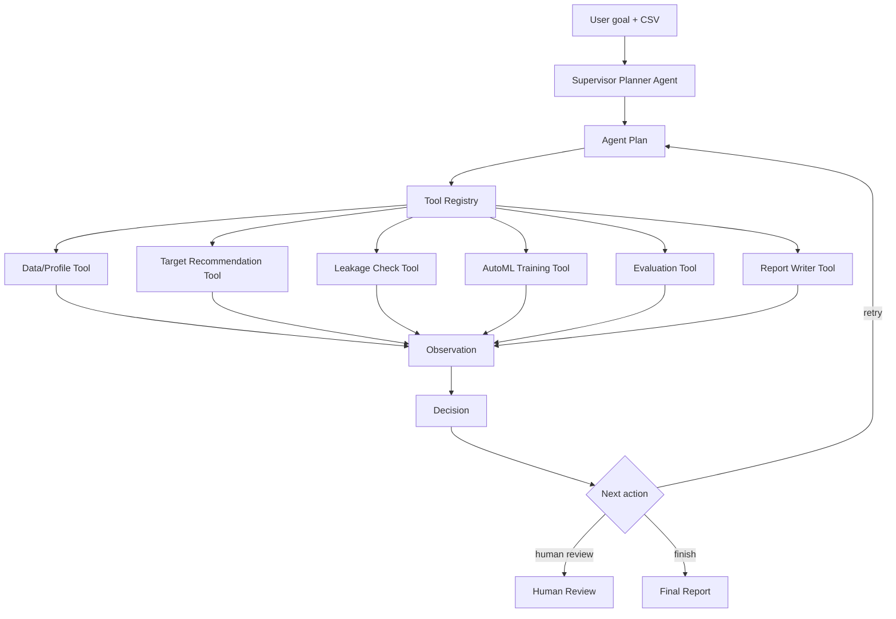

# ModelMate Agent Architecture

현재 상태: PR-01 skeleton 단계입니다. 이 문서는 최종 Agentic AutoML 방향을 설명하지만,
이번 PR에서는 기존 ModelMate 실행 흐름에 연결하지 않습니다.

## 목표

ModelMate의 최종 목표는 단순 AutoML 실행기나 LLM 요약기가 아니라, 사용자의 분석 목표를
해석하고 필요한 도구를 골라 실행하며, 관찰 결과와 의사결정을 남기는 tool-calling AI Agent
기반 Agentic AutoML 플랫폼입니다.

최종 실행 흐름은 다음 순서를 기준으로 합니다.

1. User goal interpretation
2. Analysis plan generation
3. Tool selection
4. Tool call execution
5. Observation recording
6. Decision recording
7. Branching, retry, or human review
8. Evidence-grounded final report

## 현재 ModelMate 구조 분석

현재 백엔드는 `backend/main.py`가 `backend/main_parts/*.py` 파일을 순서대로 읽어 하나의
FastAPI 앱으로 조립합니다. 기존 업로드, 컬럼 분석, 타겟 설정, 모델 비교, Optuna, XAI,
예측, 공유/API, 작업 기록 기능은 `main_parts`에 분산되어 있습니다.

PR-01에서는 이 구조를 유지합니다.

- `backend/main.py` 수정 없음
- `backend/main_parts` 수정 없음
- 기존 endpoint 삭제 없음
- 기존 AutoML 파이프라인 연결 변경 없음
- 새 agent 코드는 import 되지 않는 비활성 skeleton

## 제안 아키텍처



## Agent 책임

`Supervisor Planner Agent`는 최종적으로 다음 책임을 가집니다.

- 사용자의 분석 목표를 구조화한다.
- CSV의 도메인, 예측 목적, 타겟 후보를 판단한다.
- 사용할 도구와 순서를 계획한다.
- 도구 실행 결과를 observation으로 읽는다.
- 다음 행동을 decision으로 저장한다.
- 재시도, 중단, 사람 검토, 최종 보고서 생성을 결정한다.

PR-01의 `backend/agents` skeleton은 이 책임을 코드 구조로만 표현합니다.

## Tool Adapter 원칙

기존 AutoML 기능은 삭제하거나 다시 만들지 않습니다. 이후 PR에서 기존 기능을 다음처럼
도구 adapter로 감쌉니다.

- 업로드/프로파일링: `data_profile_tool`
- 컬럼/스키마 검사: `schema_validation_tool`
- 타겟 추천: `target_recommendation_tool`
- 누수 검사: `leakage_check_tool`
- 모델 비교/학습: `automl_training_tool`
- 성능 평가: `evaluation_tool`
- XAI/중요 변수: `shap_explainer_tool`
- 보고서 생성: `report_writer_tool`
- 배포 가능성 확인: `deployment_check_tool`

## 상태 모델 준비

PR-02에서 추가할 최소 상태 단위는 다음과 같습니다.

- `analysis_runs`: 사용자의 목표 단위 agent 실행
- `analysis_steps`: plan, tool, observation, decision 단계
- `tool_calls`: 실제 도구 호출 로그
- `observations`: 도구 결과를 agent가 읽은 관찰값
- `decisions`: observation 기반 다음 행동 결정

PR-01의 `backend/schemas/agent/contracts.py`는 위 개념을 DB에 연결하지 않은 Python 계약으로만
정의합니다.

## PR-01 테스트

기존 실행을 깨지 않는지 확인합니다.

```bash
python -m compileall backend/agents backend/tools backend/schemas
uvicorn backend.main:app --reload
```

수동 확인:

1. 기존 Railway 또는 로컬 페이지 접속
2. CSV 업로드
3. 모델 비교
4. 결과 요약/XAI/작업 기록 확인

PR-01 코드는 기존 앱에 import 되지 않으므로 화면 변화가 없어야 정상입니다.
